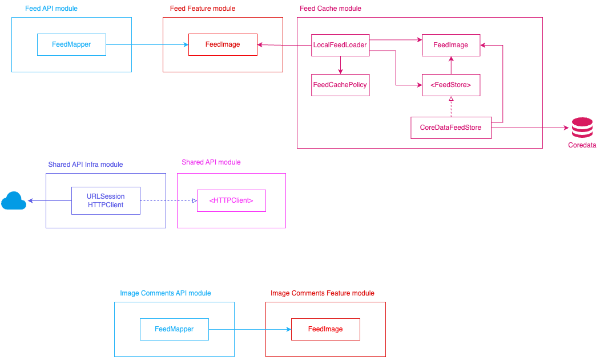
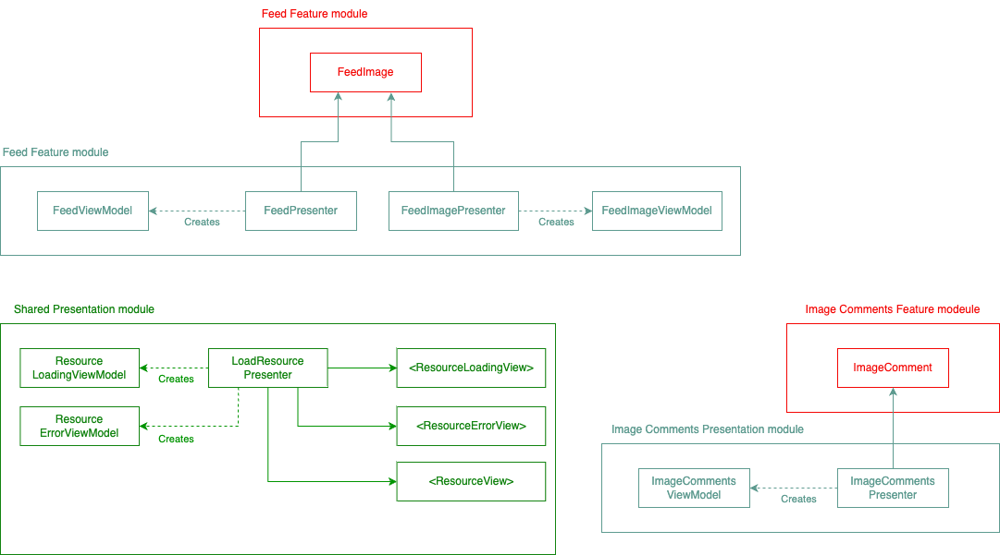
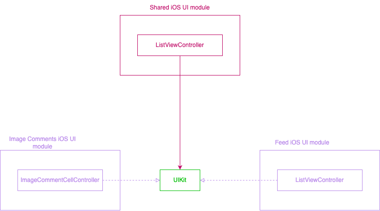
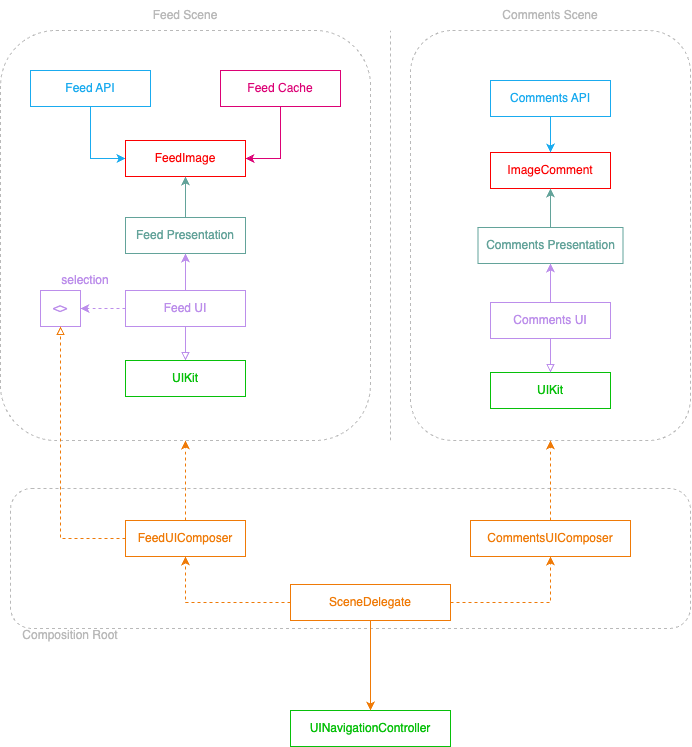

# Essential Feed Case

## About the project
The proposit of this repository is to implement all that I learned from Essential Developers "iOS Lead Essentials" course

## Feature Specs documents
[Image Feed Feature](docs/features/image-feed.md)

[Image Comments Feature](docs/features/image-comments.md)

## Architecture

### API

### Presentation

### UI

### Composition

## Getting Started

### Requirements
- [Xcode](https://developer.apple.com/xcode/)